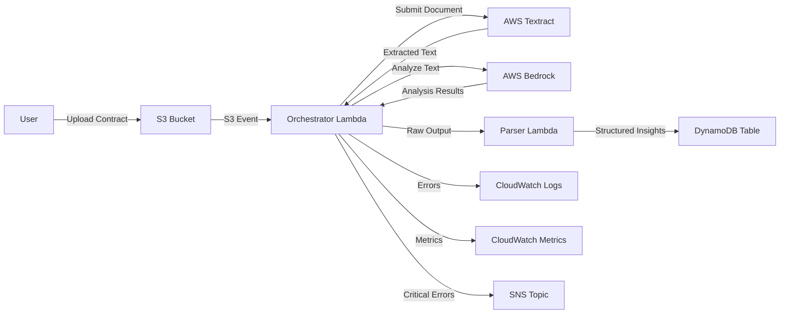

# Design Document: Contract Analysis Pipeline

## Overview

The Contract Analysis Pipeline is a serverless, event-driven system built on AWS that automates the extraction and analysis of legal contracts. The architecture follows a linear processing flow where each stage is loosely coupled through AWS managed services, ensuring scalability, reliability, and maintainability.

The pipeline consists of six primary components:

1. **S3 Bucket**: Entry point for contract documents, configured with event notifications
2. **Orchestrator Lambda**: Coordinates the workflow, manages state, and handles error recovery
3. **AWS Textract**: Extracts text and structure from PDF and image documents
4. **AWS Bedrock**: Performs AI-powered analysis to identify key contract elements
5. **Parser Lambda**: Validates, transforms, and enriches analysis output
6. **DynamoDB Table**: Stores structured contract insights with queryable indexes

The system is fully defined in CloudFormation templates, enabling infrastructure-as-code deployment with environment-specific parameterization. All components communicate asynchronously to handle variable processing times and support retry mechanisms for transient failures.

### Key Design Decisions

**Event-Driven Architecture**: S3 event notifications trigger the pipeline automatically, eliminating the need for polling and reducing latency between upload and processing.

**Asynchronous Processing**: Textract jobs run asynchronously for documents larger than 1MB, allowing the orchestrator to handle long-running extractions without timeout constraints.

**Separation of Concerns**: The orchestrator handles workflow logic while the parser handles data transformation, creating clear boundaries that simplify testing and maintenance.

**Managed Services**: Leveraging AWS managed services (Textract, Bedrock, DynamoDB) reduces operational overhead and provides built-in scalability.

## Architecture

### System Flow

### Component Interactions

**S3 → Orchestrator Lambda**
- Trigger: S3 `ObjectCreated` event notification
- Payload: Event metadata i